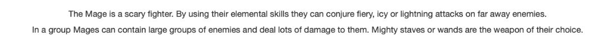
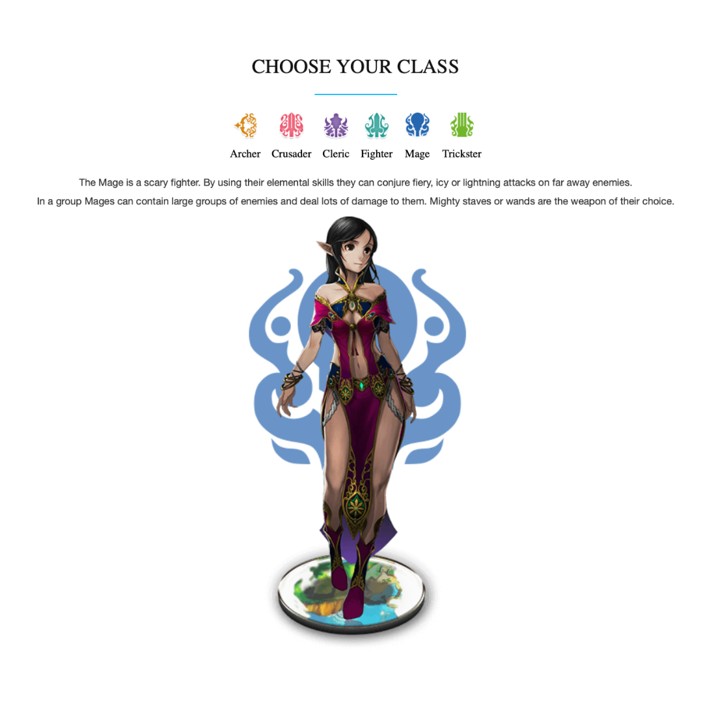

# Fiesta Online Web Template

This is a responsive, customizable website template designed for Fiesta Online enthusiasts or any similar gaming community. The template includes a class selection interface, full-size image display, parallax effects, and is optimized for mobile responsiveness.

## Features

- **Class Selection Interface**: Displays class icons in a row. Selecting a class icon reveals a detailed description and a full-size image.
- **Parallax Scrolling**: Subtle parallax effect for desktop and mobile that provides a smooth user experience without overbearing movement.
- **Mobile Friendly**: Fully responsive design, addressing issues like background images and horizontal scrolling on mobile devices.
- **Simple Customization**: Modify classes, images, and descriptions easily within the `.html` and `.css` files.
- **Optimized Media Display**: Full-width display of images when a class icon is selected, with neatly formatted text descriptions.

## Preview


You can view the live website [here](https://fiesta.lanteacorp.com/).

## Getting Started

To use this template, follow the instructions below.

### Prerequisites

- Basic understanding of HTML and CSS.
- [Git](https://git-scm.com/) installed on your local machine.

### Installation

1. Clone this repository to your local machine:
   ```bash
   git clone https://github.com/yourusername/fiesta-online-template.git

2. Navigate to the project folder:
   ```bash
   cd fiesta-online-template

3. Open index.html in your preferred code editor to start customizing.
   ```bash

## Customizing the Template

1. **Class Icons**: Add your own icons by replacing the existing ones in the `assets/icons/` folder.
   
   
2. **Class Descriptions**: Update the text and images for each class in the `index.html` file.
   
   
3. **Images**: Replace the main class images in the `assets/images/` folder.
   
   
4. **Parallax Effect**: Modify the parallax effect speed and behavior in the `script.js` file if needed.

## Deployment

To deploy your own version of the template:

1. After customizing, host the files on any static web hosting service such as GitHub Pages, Netlify, or your own server.

## Issues

If you encounter any issues or have questions about the template, feel free to open a GitHub issue or contact me.

## License

This project is licensed under the MIT License. Feel free to use and modify the template for your own projects.

## Acknowledgements

This template was developed as part of a personal project to enhance the gaming experience for Fiesta Online players. Special thanks to the Fiesta Online community and everyone who provides feedback!